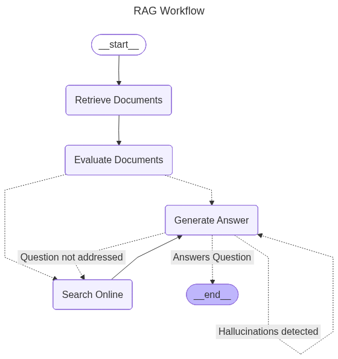

### О проекте

Проект демонстрирует, как создать систему RAG (Retrieval-Augmented Generation) с использованием графа. Реализован с помощью следующих технологий:
- [LangGraph](https://github.com/langchain-ai/langgraph) — фреймворк для построения агентов с помощью графов
- [LangChain](https://github.com/langchain-ai/langchain) — фреймворк для создания приложений на базе LLM
- [llama.cpp](https://github.com/ggml-org/llama.cpp) — движок для инфернса open-source LLM на ЦПУ/ГПУ
- [Qdrant](https://github.com/qdrant/qdrant) — высокопроизводительная векторная база данных
- [MLflow](https://github.com/mlflow/mlflow) — платформа для создания моделей  и AI/LLM приложений
- [SentenceTransformers](https://huggingface.co/sentence-transformers) — фреймворк для создания высокого качества эмбеддингов для текста

Граф реализованной системы имеет следующий вид:


где основные узлы это:
- `Retrieve Documents` — извлечение релевантных документов на основании вопроса пользователя
- `Evaluate Documents` — оценка релевантности извлеченных документов
- `Search Online` — поиск информации онлайн, если извлеченные документы не позволяют ответить на вопрос или в базе данных не содержится ответа на вопрос
- `Generate Answer` — генерация ответа на основании полученных документов

условные ребра графа
- `Hallucinations detected` — оценка сгенерированного ответа на наличие галлюцинаций (выдуманные факты, не содержащиеся в извлеченных документах, ответ не отвечающий на вопрос)
- `Question not addressed` — оценка сгенерированного ответа насколько точно он отвечает на вопрос пользователя. 

<hr>


### Данные для RAG

Ссылка на датасет: [galileo-ai/ragbench](https://huggingface.co/datasets/galileo-ai/ragbench)
Описание датасета: [RAGBench: Explainable Benchmark for Retrieval-Augmented Generation Systems](https://arxiv.org/html/2407.11005v1)

<hr>


### Настройка окружения

Установим необходимые пакеты на Ubuntu:
```sh
sudo apt -q update
sudo apt -q -y install build-essential cmake wget zip unzip

gcc --version
cmake -version
```

Формирование `__pycache__` файлов в директории `~/.cache` а не в дириктории проекта:
```
echo 'export PYTHONPYCACHEPREFIX="${HOME}/.cache/pycache"' >> "${HOME}/.bashrc"
```

Установим `docker` по инстркуциями из [официальной документации](https://docs.docker.com/engine/install/ubuntu/):
```sh
for pkg in docker.io docker-doc docker-compose docker-compose-v2 podman-docker containerd runc; do sudo apt-get remove $pkg; done
```

```sh
sudo apt-get update
sudo apt-get install ca-certificates curl
sudo install -m 0755 -d /etc/apt/keyrings
sudo curl -fsSL https://download.docker.com/linux/ubuntu/gpg -o /etc/apt/keyrings/docker.asc
sudo chmod a+r /etc/apt/keyrings/docker.asc

echo \
  "deb [arch=$(dpkg --print-architecture) signed-by=/etc/apt/keyrings/docker.asc] https://download.docker.com/linux/ubuntu \
  $(. /etc/os-release && echo "${UBUNTU_CODENAME:-$VERSION_CODENAME}") stable" | \
  sudo tee /etc/apt/sources.list.d/docker.list > /dev/null
sudo apt-get update
```

```sh
sudo apt-get install docker-ce docker-ce-cli containerd.io docker-buildx-plugin docker-compose-plugin
```

Проверим, что `docker` установлен с помощью команды:
```sh
sudo docker -v
```

Добавим команду запуска `docker` не из-под суперпользователя
```sh
sudo usermod -aG docker $USER
```

<hr>


### Установка llama.cpp и скачивание моделей

Создаем в домашней директории новую директорию `.llama.cpp`:
```sh
cd && mkdir .llama.cpp && cd .llama.cpp
```

Скачиваем последний релиз `llama.cpp` для Linux Ubuntu:
```sh
wget https://github.com/ggml-org/llama.cpp/releases/download/b6708/llama-b6708-bin-ubuntu-x64.zip
```

Распаковываем zip архив и удаляем после распаковки:
```sh
unzip llama-b6708-bin-ubuntu-x64.zip && rm llama-b6708-bin-ubuntu-x64.zip
```

Для запуска из любой директории `llama.cpp` сервера созданим мягкую ссылку на исполняемую программу:
```sh
sudo ln -s ~/.llama.cpp/build/bin/llama-server /usr/local/bin/llama-server
```

Проверяем работоспособность программы:
```sh
llama-server -h
```

В результате будет получена справка по запуску сервера:
```
----- common params -----
  
-h,    --help, --usage                  print usage and exit
--version                               show version and build info
--completion-bash                       print source-able bash completion script
--verbose-prompt                        print a verbose prompt before generation (default: false)
```

Создадим директорию для храниния скачиваемых моделей
```sh
mkdir models
```

Для реализации проекта скачаем модель [unsloth/Qwen3-0.6B-GGUF](https://huggingface.co/unsloth/Qwen3-0.6B-GGUF) с квантизацией `Q8_K_XL`:
```sh
wget -O ~/.llama.cpp/models/Qwen3-0.6B-UD-Q8_K_XL.gguf https://huggingface.co/unsloth/Qwen3-0.6B-GGUF/resolve/main/Qwen3-0.6B-UD-Q8_K_XL.gguf?download=true
```

Не обязательно! Можно также скачать для локального пользования модель [unsloth/gpt-oss-20b-GGUF](https://huggingface.co/unsloth/gpt-oss-20b-GGUF) с квантизацией `Q8_K_XL`:
```sh
wget -O ~/.llama.cpp/models/gpt-oss-20b-UD-Q8_K_XL.gguf https://huggingface.co/unsloth/gpt-oss-20b-GGUF/resolve/main/gpt-oss-20b-UD-Q8_K_XL.gguf?download=true
```

