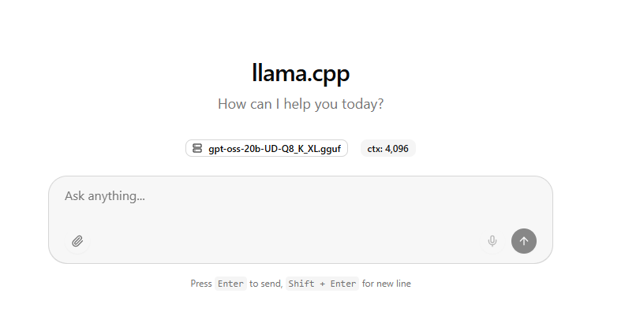
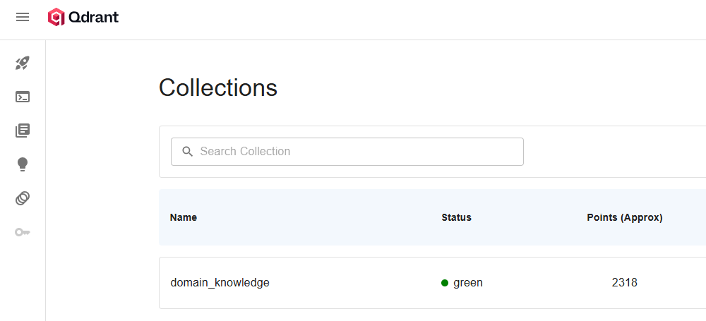
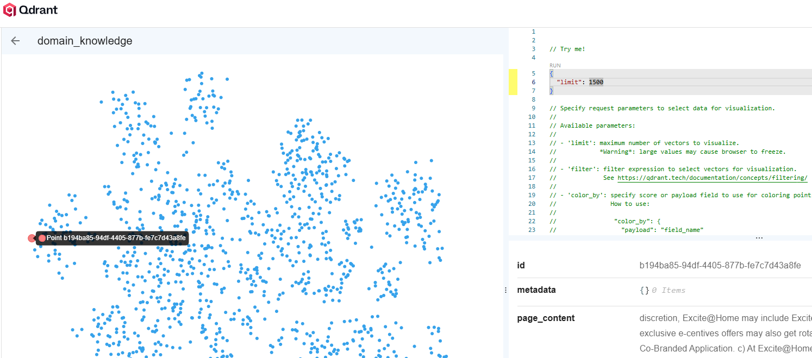
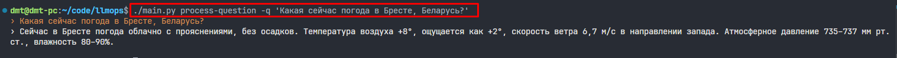
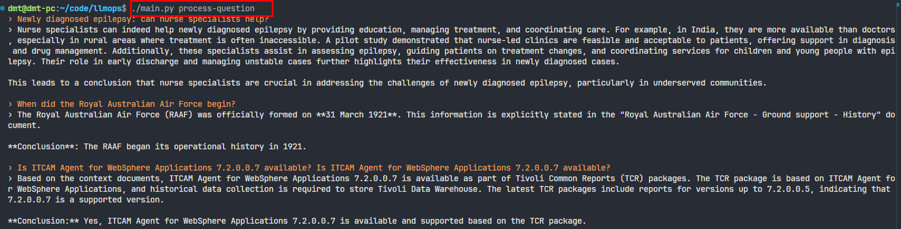
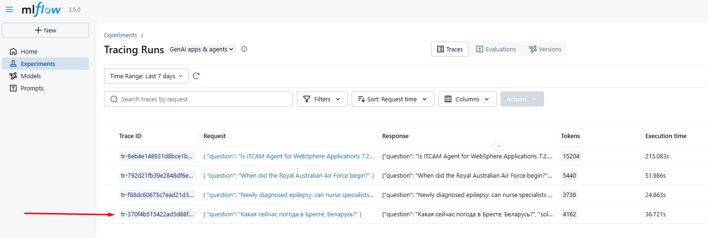
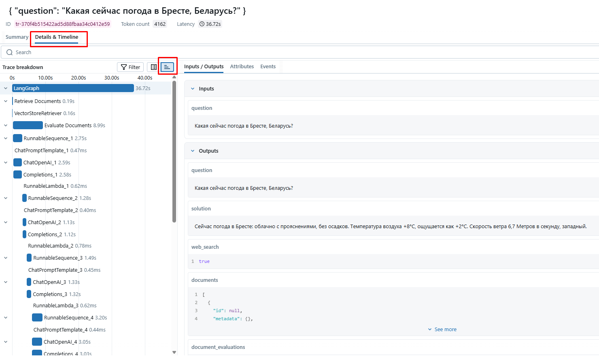
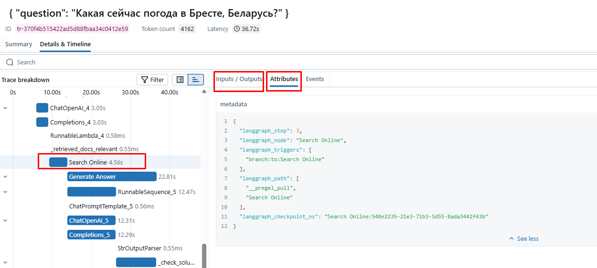
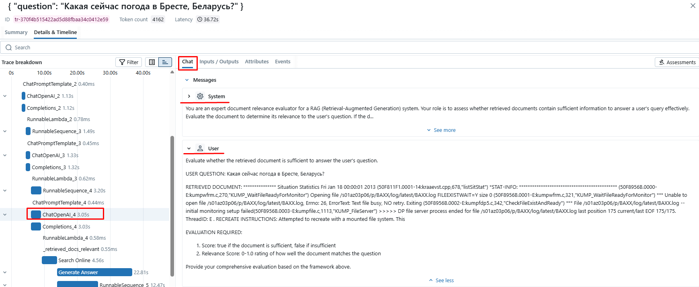

### О проекте

Проект демонстрирует, как создать систему RAG (Retrieval-Augmented Generation) с использованием графа. Реализован с помощью следующих технологий:
- [LangGraph](https://github.com/langchain-ai/langgraph) — фреймворк для построения агентов с помощью графов
- [LangChain](https://github.com/langchain-ai/langchain) — фреймворк для создания приложений на базе LLM
- [llama.cpp](https://github.com/ggml-org/llama.cpp) — движок для инфернса open-source LLM на ЦПУ/ГПУ
- [Qdrant](https://github.com/qdrant/qdrant) — высокопроизводительная векторная база данных
- [MLflow](https://github.com/mlflow/mlflow) — платформа для создания моделей  и AI/LLM приложений
- [SentenceTransformers](https://huggingface.co/sentence-transformers) — фреймворк для создания высокого качества эмбеддингов для текста

Граф реализованной системы имеет следующий вид:

где основные узлы это:
- `Retrieve Documents` — извлечение релевантных документов на основании вопроса пользователя
- `Evaluate Documents` — оценка релевантности извлеченных документов
- `Search Online` — поиск информации онлайн, если извлеченные документы не позволяют ответить на вопрос или в базе данных не содержится ответа на вопрос
- `Generate Answer` — генерация ответа на основании полученных документов

условные ребра графа
- `Hallucinations detected` — оценка сгенерированного ответа на наличие галлюцинаций (выдуманные факты, не содержащиеся в извлеченных документах, ответ не отвечающий на вопрос)
- `Question not addressed` — оценка сгенерированного ответа насколько точно он отвечает на вопрос пользователя. 

<hr>


### Настройка окружения

Установим необходимые пакеты на Ubuntu:
```sh
sudo apt -q update
sudo apt -q -y install build-essential cmake wget zip unzip

gcc --version
cmake -version
```

Формирование `__pycache__` файлов в директории `~/.cache` а не в дириктории проекта:
```
echo 'export PYTHONPYCACHEPREFIX="${HOME}/.cache/pycache"' >> "${HOME}/.bashrc"
```

Установим `docker` по инстркуциями из [официальной документации](https://docs.docker.com/engine/install/ubuntu/):
```sh
for pkg in docker.io docker-doc docker-compose docker-compose-v2 podman-docker containerd runc; do sudo apt-get remove $pkg; done
```

```sh
sudo apt-get update
sudo apt-get install ca-certificates curl
sudo install -m 0755 -d /etc/apt/keyrings
sudo curl -fsSL https://download.docker.com/linux/ubuntu/gpg -o /etc/apt/keyrings/docker.asc
sudo chmod a+r /etc/apt/keyrings/docker.asc

echo \
  "deb [arch=$(dpkg --print-architecture) signed-by=/etc/apt/keyrings/docker.asc] https://download.docker.com/linux/ubuntu \
  $(. /etc/os-release && echo "${UBUNTU_CODENAME:-$VERSION_CODENAME}") stable" | \
  sudo tee /etc/apt/sources.list.d/docker.list > /dev/null
sudo apt-get update
```

```sh
sudo apt-get install docker-ce docker-ce-cli containerd.io docker-buildx-plugin docker-compose-plugin
```

Проверим, что `docker` установлен с помощью команды:
```sh
sudo docker -v
```

Добавим команду запуска `docker` не из-под суперпользователя
```sh
sudo usermod -aG docker $USER
```

<hr>


### Установка llama.cpp и скачивание моделей

Создаем в домашней директории новую директорию `.llama.cpp`:
```sh
cd && mkdir .llama.cpp && cd .llama.cpp
```

Скачиваем последний релиз `llama.cpp` для Linux Ubuntu:
```sh
wget https://github.com/ggml-org/llama.cpp/releases/download/b6708/llama-b6708-bin-ubuntu-x64.zip
```

Распаковываем zip архив и удаляем после распаковки:
```sh
unzip llama-b6708-bin-ubuntu-x64.zip && rm llama-b6708-bin-ubuntu-x64.zip
```

Для запуска из любой директории `llama.cpp` сервера созданим мягкую ссылку на исполняемую программу:
```sh
sudo ln -s ~/.llama.cpp/build/bin/llama-server /usr/local/bin/llama-server
```

Проверяем работоспособность программы:
```sh
llama-server -h
```

В результате будет получена справка по запуску сервера:
```
----- common params -----
  
-h,    --help, --usage                  print usage and exit
--version                               show version and build info
--completion-bash                       print source-able bash completion script
--verbose-prompt                        print a verbose prompt before generation (default: false)
```

Создадим директорию для храниния скачиваемых моделей
```sh
mkdir models
```

Для реализации проекта скачаем модель [unsloth/Qwen3-0.6B-GGUF](https://huggingface.co/unsloth/Qwen3-0.6B-GGUF) с квантизацией `Q8_K_XL`:
```sh
wget -O ~/.llama.cpp/models/Qwen3-0.6B-UD-Q8_K_XL.gguf https://huggingface.co/unsloth/Qwen3-0.6B-GGUF/resolve/main/Qwen3-0.6B-UD-Q8_K_XL.gguf?download=true
```

Не обязательно! Можно также скачать для локального пользования модель [unsloth/gpt-oss-20b-GGUF](https://huggingface.co/unsloth/gpt-oss-20b-GGUF) с квантизацией `Q8_K_XL`:
```sh
wget -O ~/.llama.cpp/models/gpt-oss-20b-UD-Q8_K_XL.gguf https://huggingface.co/unsloth/gpt-oss-20b-GGUF/resolve/main/gpt-oss-20b-UD-Q8_K_XL.gguf?download=true
```

Запустить сервер для теста можно с помощью команды в терминале:
```sh
llama-server -m ~/.llama.cpp/models/gpt-oss-20b-UD-Q8_K_XL.gguf --jinja
```

Сервер будет доступен в веб браузере по адресу:
http://localhost:8080/



<hr>


### Данные для RAG

Ссылка на датасет: [galileo-ai/ragbench](https://huggingface.co/datasets/galileo-ai/ragbench)
Описание датасета: [RAGBench: Explainable Benchmark for Retrieval-Augmented Generation Systems](https://arxiv.org/html/2407.11005v1)

Датасет для проекта будет формироваться из данных для теста, домены: медицина, юрисприденция, финансы, техническая поддержка клиентов, общий домен. Из каждого домена берется по 25 документов, размер которых превышает 2500 символов. Из этих 25 документов по каждому домену берется 5 документов (вопрос и правильный ответ) для формирования валидационных данных. Валидационные данные нужны для финальной проверки работоспособности реализованной системы.

<hr>


### Инициализация и запуск проекта

Устанавливаем пакетный менеджер [uv](https://docs.astral.sh/uv/getting-started/installation/):
```sh
curl -LsSf https://astral.sh/uv/install.sh | sh
```

Чтобы изменения внесённые в файл `bashrc` в текущем сеансе терминала вступили в силу, файл необходимо перезагрузить:
```sh
source ~/.bashrc
```

Копируем репозиторий:
```sh
git clone https://github.com/dmt-zh/llmops.git && cd llmops
```

Создаем виртуальное окружение и устанавливаем зависимости:
```sh
uv sync
```

Создаем `.env` файл на основании файла `.env.example`:
```sh
cp .env.example .env
```

Редактируем переменные в файле `.env`

Добавляем права запуска скрипту `main.py`
```sh
chmod +x main.py
```

В `Makefile` содержаться команды управления инфраструктурой и проверки кода с помощью линтера `ruff`. Получить справку можно с помощью следующей команды:
```sh
make help
```

В результате будет получен следующий вывод:
```
› help: Display help message with available commands
› llama-server-up: Start inference of a local LLM with llama.cpp server
› llama-server-down: Terminate llama.cpp server
› services-up: Start local services using Docker Compose
› services-down: Stop and remove local services
› lint-check: Check code for linting issues without making changes
› lint-fix: Fix linting issues using ruff
```

Запускаем сервер `llama.cpp` в фоновом режиме с моделью `Qwen3-0.6B-UD-Q8_K_XL.gguf`:
```sh
make llama-server-up
```

Запускаем инфраструктуры для работы RAG системы: Qdrant, MLflow сервер, Postgres, MinIO S3 (Postgres и MinIO S3 нужны для работы MLflow):
```sh
make services-up
```

Необходимо подождать пока сервер MLflow начнет работу. Запуск сервера можно посмотреть с помощью команды:
```sh
docker logs mlflow-server --tail 50 -f
```

При успешном запуске MLflow сервера, будет соответствующая запись логах
```
[MLflow] Security middleware enabled with default settings (localhost-only). To allow connections from other hosts, use --host 0.0.0.0 and configure --allowed-hosts and --cors-allowed-origins.
INFO:     Uvicorn running on http://0.0.0.0:5000 (Press CTRL+C to quit)
...
INFO:     Application startup complete.
INFO:     127.0.0.1:45410 - "GET /health HTTP/1.1" 200 OK
INFO:     127.0.0.1:50666 - "GET /health HTTP/1.1" 200 OK
```


Основной точкой входа для работы RAG системы является скрипт `main.py`. С помощью следующей команды можно посмотреть справку по доступным аргументам запуска:
```sh
./main.py
```

В результате будет получен следующий вывод:
```
Usage: main.py [OPTIONS] COMMAND [ARGS]...

  The entrypoint of the project.

Options:
  --help  Show this message and exit.

Commands:
  create-collection  Create a new Qdrant collection.
  create-datasets    Download and create datasets for RAG systems.
  delete-collection  Delete all data from the Qdrant collection.
  process-question   Run the Q&A processing workflow.
```

**Скачиваем данные и формируем основной и валидационный датасеты:**
```sh
./main.py create-datasets
```

После завершеня работы команды будет сформирована следующая файловая структура:
```
├── data
│   ├── download_data.py
│   ├── eval_dataset.json
│   └── main_dataset.json
```

 **Создаем коллекцию в векторной базе данных и наполняем ее эмбеддингами на основании частей текста, полученных из документов основного датасета  `main_dataset.json`**:
```
./main.py create-collection
```

На выполнение этой команды может потребоваться от 30 мин. до 2 часов, в зависимости от мощности CPU. В результате векторная база данных будет содержать более 2 тыс. эмбеддингов. Созданная коллекция будет доступна в веб браузере по ссылке:
http://localhost:6333/dashboard#/collections


Посмотреть на кластеры эмбеддингов можно странице коллекции по ссылке в веб браузере:
http://localhost:6333/dashboard#/collections/domain_knowledge/visualize


#### Обработка вопросов

**Обработка вопросов осуществляется с помощью команды:**
```sh
./main.py process-question -q 'вопрос_который_необходимо обработать'
```


Параметр `-q` необязательный. Если его не передавать, то вопросы будут считываться из файла `questions.txt`:
```sh
./main.py process-question
```


<hr>


### Мониторинг работы системы

Для детального понимания что происходит на каждом шаге работы RAG системы используется MLflow сервер для автоматического трекинга вызовов, происходящих в Langchain и OpenAI API.

После выполнения команд `./main.py process-question -q 'вопрос_который_необходимо обработать'` и `./main.py process-question` можно проанализировать ход выполненя обработки вопросов на странице трекинга: http://localhost:5000/#/experiments/1/traces


Можно также детально ознакомится с графов выполнения по каждому отдельному запросу нажав на идентификатор нужного вопроса.


Так же можно посмотреть всю информация по отедьльному шагу, как промты, так и метаинформацию.



<hr>

